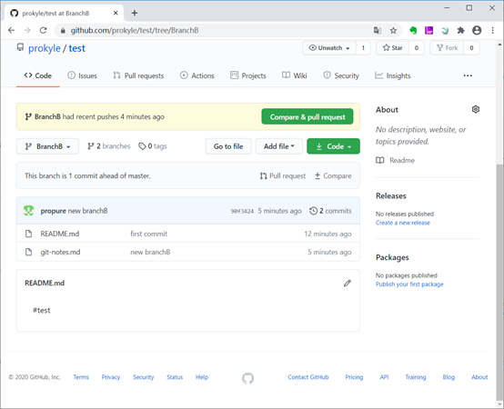

<u>***git笔记***</u>

------

# clone一个刚刚创建的Repository

```
D:\github>md prokyle

D:\github>cd prokyle

#不是clone这个账户名，而是账户下的repositories
D:\github\prokyle>git clone https://github.com/prokyle

Cloning into 'prokyle'...

remote: Not Found

fatal: repository 'https://github.com/prokyle/' not found

#不是clone这个账户名，而是账户下的repositories
D:\github\prokyle>git clone https://github.com/prokyle.git

Cloning into 'prokyle'...

remote: Not Found

fatal: repository 'https://github.com/prokyle.git/' not found

# git clone https://github.com/账户/仓库.git
D:\github\prokyle>git clone https://github.com/prokyle/Python.git

Cloning into 'Python'...

Username for 'https://github.com': prolee\@prokyle.com

Password for 'https://prolee\@prokyle.com\@github.com':

warning: You appear to have cloned an empty repository.

D:\github\prokyle>dir

驱动器 D 中的卷没有标签。

卷的序列号是 74CE-7376

D:\github\prokyle 的目录

2020/08/01 13:15 <DIR> .

2020/08/01 13:15 <DIR> ..

2020/08/01 13:15 <DIR> Python

0 个文件 0 字节

3 个目录 822,174,916,608 可用字节
```


------

# 创建新的Repository

## 通过浏览器在github里创建Repository


```
D:\github\prokyle>md test

D:\github\prokyle>cd test

D:\github\prokyle\test>dir

驱动器 D 中的卷没有标签。

卷的序列号是 74CE-7376

D:\github\prokyle\test 的目录

2020/08/01 13:25 <DIR> .

2020/08/01 13:25 <DIR> ..

0 个文件 0 字节

2 个目录 822,175,023,104 可用字节

D:\github\prokyle\test>git init

Initialized empty Git repository in D:/github/prokyle/test/.git/

D:\github\prokyle\test>echo #test >README.md

D:\github\prokyle\test>git add README.md

D:\github\prokyle\test>git commit -m "first commit"

[master (root-commit) a0bc70b] first commit

1 file changed, 1 insertion(+)

create mode 100644 README.md

D:\github\prokyle\test>git remote add origin https://github.com/prokyle/test.git

D:\github\prokyle\test>git push -u origin master

Username for 'https://github.com': prolee\@prokyle.com

Password for 'https://prolee\@prokyle.com\@github.com':

Enumerating objects: 3, done.

Counting objects: 100% (3/3), done.

Writing objects: 100% (3/3), 214 bytes | 214.00 KiB/s, done.

Total 3 (delta 0), reused 0 (delta 0), pack-reused 0

To https://github.com/prokyle/test.git

* [new branch] master -> master

Branch 'master' set up to track remote branch 'master' from 'origin'.
```

------

# 修改/增加文件 提交到远程仓库

1.git status 查看git是否有修改内容需要提交

2.git add 指向需要提交的内容文件

3.git commit 提交到本地库

4.git push 提交代码到当前分支，一般就是master

或git push origin master 提交到指定的远程仓库的master分支

如果多人同时开发维护代码，得先git pull,拉取当前分支最新代码

git pull


git status

查看当前状态命令 图中modified:图中红色的文件路径告诉你有哪些文件有修改

```
D:\github\prokyle\test>git status
```


git commit -a

```
D:\github\prokyle\test>git status
```


```
D:\github\prokyle\test>echo new line >> README.md

D:\github\prokyle\test>git status

On branch master

Your branch is up to date with 'origin/master'.

Changes not staged for commit:

(use "git add <file>..." to update what will be committed)

(use "git restore <file>..." to discard changes in working directory)

modified: README.md

no changes added to commit (use "git add" and/or "git commit -a")

D:\github\prokyle\test>git add . #或则git add README.md或git add *

D:\github\prokyle\test>git commit -m "3th commit"

[master f5ec656] 3th commit

1 file changed, 1 insertion(+)

D:\github\prokyle\test>git push

Username for 'https://github.com': prolee\@prokyle.com

Password for 'https://prolee\@prokyle.com\@github.com':

remote: Invalid username or password.

fatal: Authentication failed for 'https://github.com/prokyle/test.git/'

D:\github\prokyle\test>git push

Username for 'https://github.com': prolee\@prokyle.com

Password for 'https://prolee\@prokyle.com\@github.com':

Enumerating objects: 5, done.

Counting objects: 100% (5/5), done.

Delta compression using up to 12 threads

Compressing objects: 100% (2/2), done.

Writing objects: 100% (3/3), 293 bytes | 293.00 KiB/s, done.

Total 3 (delta 0), reused 0 (delta 0), pack-reused 0

To https://github.com/prokyle/test.git

3bf9dd8..f5ec656 master -> master

D:\github\prokyle\test>git add README.md

D:\github\prokyle\test>git commit -m "2nd commit"

[master 3bf9dd8] 2nd commit

1 file changed, 1 insertion(+)

D:\github\prokyle\test>git push origin master

Username for 'https://github.com': prolee\@prokyle.com

Password for 'https://prolee\@prokyle.com\@github.com':

Enumerating objects: 5, done.

Counting objects: 100% (5/5), done.

Delta compression using up to 12 threads

Compressing objects: 100% (2/2), done.

Writing objects: 100% (3/3), 289 bytes | 289.00 KiB/s, done.

Total 3 (delta 0), reused 0 (delta 0), pack-reused 0

To https://github.com/prokyle/test.git

90f3424..3bf9dd8 master -> master
```


------

# 删除文件 提交到远程仓库

```
D:\>cd \github\prokyle\gitman

D:\github\prokyle\gitman>git rm vim-userman2.md
rm 'vim-userman2.md'

D:\github\prokyle\gitman>git commit -m "%date%%time% remove vim-userman2.md"
[master 4635124] 2020/08/02 周日12:57:12.70 remove vim-userman2.md
 1 file changed, 94 deletions(-)
 delete mode 100644 vim-userman2.md

D:\github\prokyle\gitman>git push
Enumerating objects: 3, done.
Counting objects: 100% (3/3), done.
Delta compression using up to 12 threads
Compressing objects: 100% (2/2), done.
Writing objects: 100% (2/2), 253 bytes | 253.00 KiB/s, done.
Total 2 (delta 1), reused 0 (delta 0), pack-reused 0
remote: Resolving deltas: 100% (1/1), completed with 1 local object.
To https://github.com/prokyle/gitman.git
   13a6466..4635124  master -> master
```


------

# 创建新分支

```
D:\github\prokyle\test>echo "new branch" >git-notes.md .

已复制 1 个文件。

D:\github\prokyle\test>git add git-notes.md

D:\github\prokyle\test>git commit -m "new branchB"

[master 90f3424] new branchB

1 file changed, 110 insertions(+)

create mode 100644 git-notes.md

D:\github\prokyle\test>git push origin master:BranchB
#仓库中原本没有BranchB，提交后会生成新分支BranchB，并将本地基于master修改的代码提交到branchB中

Username for 'https://github.com': prolee\@prokyle.com

Password for 'https://prolee\@prokyle.com\@github.com':

Enumerating objects: 4, done.

Counting objects: 100% (4/4), done.

Delta compression using up to 12 threads

Compressing objects: 100% (3/3), done.

Writing objects: 100% (3/3), 1.25 KiB | 1.25 MiB/s, done.

Total 3 (delta 0), reused 0 (delta 0), pack-reused 0

remote:

remote: Create a pull request for 'BranchB' on GitHub by visiting:

remote: https://github.com/prokyle/test/pull/new/BranchB

remote:

To https://github.com/prokyle/test.git

* [new branch] master -> BranchB
```




------

# 图形化工具git gui

```
D:\github\prokyle\test>git gui
```


------

# 创建分支命令行

git branch branchName(在本地创建一个命名为branchName的分支)

git branch 查看当前自己所在的分支

git branch -a 查看服务器的所有分支以及自己当前所在的分支

git push origin branchName(把命名为branchName的本地分支推送到服务器)

git checkout --track origin/branchName (切换为远程服务器上的命名为branchName的远程分支)

如果你的搭档要把他本地的分支给关联到服务器上命名为branchName的远程分支，请执行以下操作，git branch --set-upstream localBranchName origin/branchName （为本地分支添加一个对应的远程分支 与之相对应）->这行命令用来关联本地的分支与服务器上的分支

完成以上操作之后，就可以进行提交代码了，但是在提交代码之前，你要确定你当前所在的分支

git pull origin branchName （从远程分支上拉取代码）

------

# git设置用户名密码

## 设置git用户名／邮箱

```
D:\github\prokyle\gitman>git config --global user.name prolee@prokyle.com

D:\github\prokyle\gitman>git config --global user.email prolee@prokyle.com
```

## git保存用户名密码

这里主要是配置一个config项

有两个方法，基本上原理都是一样，都是修改`.git/config`文件

1.在项目所在位置打开git-bash， 在git bash交互环境输入命令：

```bash
git config credential.helper store
```

2.使用如下命令，修改config文件即可保存

```bash
echo "[credential]" >> .git/config
echo "    helper = store" >> .git/config12
```

3.直接修改`.git/config`文件

```
D:\github\prokyle\gitman>vim .git/config
```

修改成如下

```
[core]
    repositoryformatversion = 0
    filemode = false
    bare = false
    logallrefupdates = true
    symlinks = false
    ignorecase = true
[remote "origin"]
    url = https://github.com/prokyle/gitman.git
    fetch = +refs/heads/*:refs/remotes/origin/*
[branch "master"]
    remote = origin
    merge = refs/heads/master
##主要是后面这两行，如果不想保存，则删除即可
[credential]
    helper = store
```

然后正常 push，第一次要输入账号密码，以后就不用了。就可以保存用户名密码，不用每次都输入了！

```
D:\github\prokyle\gitman>git config credential.helper store


```

#修改一个文件然后提交

```
D:\github\prokyle\gitman>git add *

D:\github\prokyle\gitman>git commit -m "%date%%time%"
[master 6ea1742] 2020/08/01 周六17:08:35.30
 1 file changed, 98 insertions(+), 1 deletion(-)

#第一次需要用户名和密码
D:\github\prokyle\gitman>git push
Username for 'https://github.com': prolee@prokyle.com
Password for 'https://prolee@prokyle.com@github.com':
Enumerating objects: 5, done.
Counting objects: 100% (5/5), done.
Delta compression using up to 12 threads
Compressing objects: 100% (3/3), done.
Writing objects: 100% (3/3), 1.34 KiB | 1.34 MiB/s, done.
Total 3 (delta 1), reused 0 (delta 0), pack-reused 0
remote: Resolving deltas: 100% (1/1), completed with 1 local object.
To https://github.com/prokyle/gitman.git
   579530b..6ea1742  master -> master
```

#再次修改文件然后提交

```
D:\github\prokyle\gitman>git add *

D:\github\prokyle\gitman>git commit -m "%date%%time%"
[master 337b550] 2020/08/01 周六17:15:37.67
 1 file changed, 2 insertions(+)

#不再需要用户名和密码
D:\github\prokyle\gitman>git push
Enumerating objects: 5, done.
Counting objects: 100% (5/5), done.
Delta compression using up to 12 threads
Compressing objects: 100% (3/3), done.
Writing objects: 100% (3/3), 318 bytes | 318.00 KiB/s, done.
Total 3 (delta 1), reused 0 (delta 0), pack-reused 0
remote: Resolving deltas: 100% (1/1), completed with 1 local object.
To https://github.com/prokyle/gitman.git
   6ea1742..337b550  master -> master
```

------

## git config查看配置

使用`git config --list`查看已设配置

```
D:\github\prokyle\gitman>git config --list
core.symlinks=false
core.autocrlf=true
core.fscache=true
color.diff=auto
color.status=auto
color.branch=auto
color.interactive=true
help.format=html
diff.astextplain.textconv=astextplain
rebase.autosquash=true
filter.lfs.clean=git-lfs clean -- %f
filter.lfs.smudge=git-lfs smudge -- %f
filter.lfs.process=git-lfs filter-process
filter.lfs.required=true
credential.helper=helper-selector
user.email=prolee@prokyle.com
user.name=prolee@prokyle.com
core.repositoryformatversion=0
core.filemode=false
core.bare=false
core.logallrefupdates=true
core.symlinks=false
core.ignorecase=true
remote.origin.url=https://github.com/prokyle/gitman.git
remote.origin.fetch=+refs/heads/*:refs/remotes/origin/*
branch.master.remote=origin
branch.master.merge=refs/heads/master
```